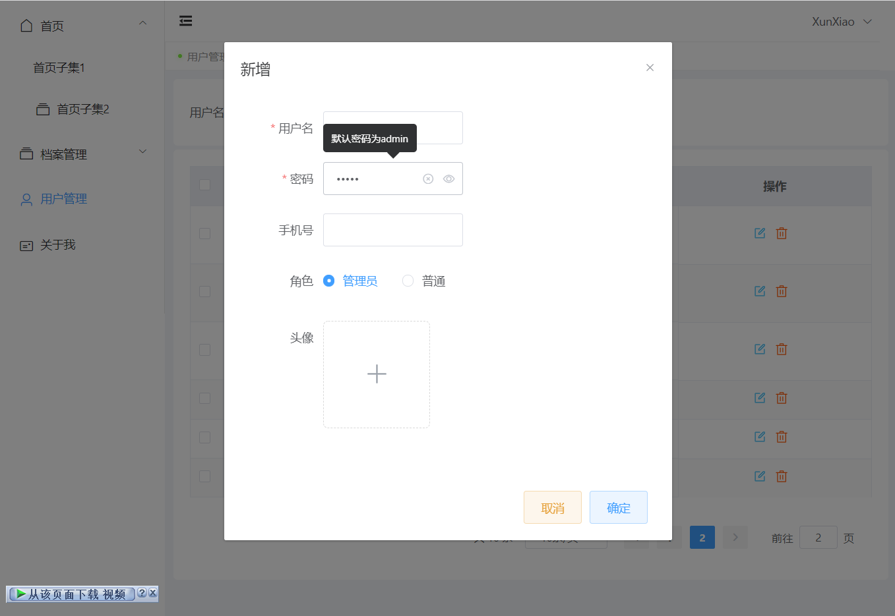

<h1 align="center">Welcome to vue-vite-ts-study 👋</h1>
<p>
  
</p>

> Vue3.x + Vite2.x + TypeScript + Vue Router + Vuex + Axios + ElementPlus

## 安装项目

```sh
npm install
```

## 启动项目

```sh
npm run dev
```

## 项目打包

```sh
npm run build
```

## 技术栈

- 编程语言：[TypeScript 4.x](https://www.typescriptlang.org/zh/) + [JavaScript](https://www.javascript.com/)
- 构建工具：[Vite 2.x](https://cn.vitejs.dev/)
- 前端框架：[Vue 3.x](https://v3.cn.vuejs.org/)
- 路由工具：[Vue Router 4.x](https://next.router.vuejs.org/zh/index.html)
- 状态管理：[Vuex 4.x](https://next.vuex.vuejs.org/)
- UI 框架：[Element Plus](https://element-plus.org/#/zh-CN)
- CSS 预编译：[Stylus](https://stylus-lang.com/) / [Sass](https://sass.bootcss.com/documentation) 
- HTTP 工具：[Axios](https://axios-http.com/)
- 代码规范：[EditorConfig](http://editorconfig.org) + [Prettier](https://prettier.io/) + [ESLint](https://eslint.org/) + [Airbnb JavaScript Style Guide](https://github.com/airbnb/javascript#translation)
- 提交规范：[Commitizen](http://commitizen.github.io/cz-cli/) + [Commitlint](https://commitlint.js.org/#/)


## Author

👤 **Mr-xun**


## Show your support

Give a ⭐️ if this project helped you!

***
_This README was generated with ❤️ by [readme-md-generator](https://github.com/kefranabg/readme-md-generator)_

#### Show Pages
<p>
  
</p>
<p>
  
</p>
<p>
  
</p>
<p>
  
</p>